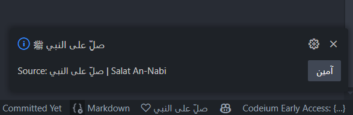
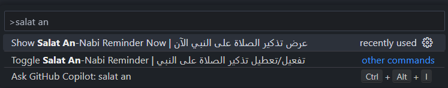
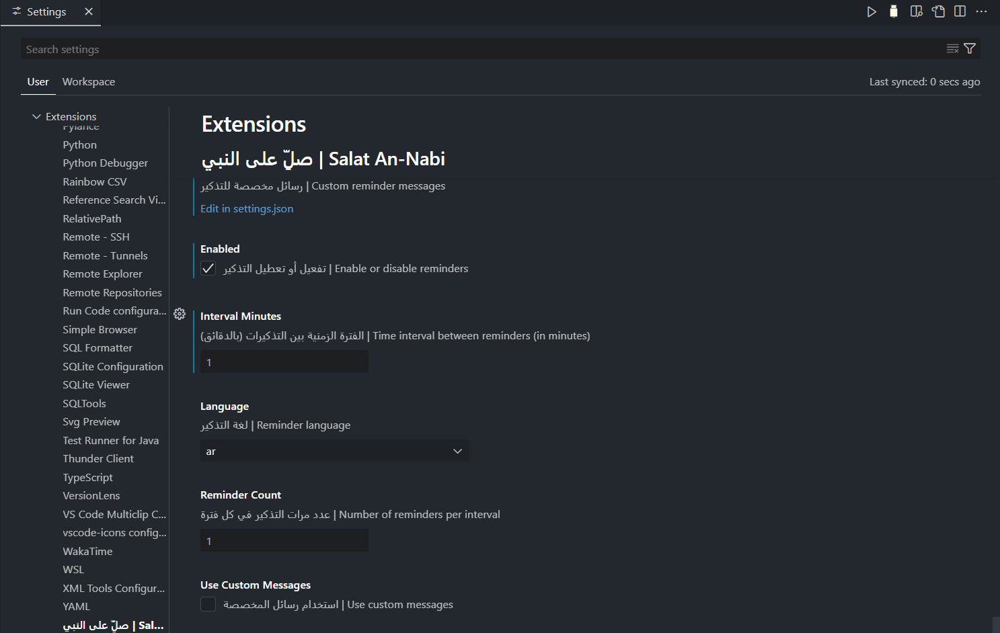

# Salat An-Nabi | صلِّ على النبي

## Overview | نبذة عن الامتداد

Salat An-Nabi is a Visual Studio Code extension that provides periodic reminders to send blessings upon Prophet Muhammad ❤️. The extension is customizable and supports multiple languages.

**امتداد Salat An-Nabi هو ملحق لـ VS Code يقوم بتذكيرك دوريًا بالصلاة على النبي محمد ❤️. الامتداد قابل للتعديل ويدعم لغات مختلفة.**

---

## Features | المميّزات

- Periodic reminders to send blessings upon the Prophet.
- Customizable reminder messages.
- Supports multiple languages (Arabic, English, French, Turkish, Urdu).
- Option to enable/disable reminders.
- Customizable reminder interval.
- Status bar integration.

**تذكيرات دورية للصلاة على النبي.**  
**إمكانية تعديل رسائل التذكير.**  
**دعم اللغات المختلفة (العربية والإنجليزية والفرنسية والتركية والأردية).**  
**خيار لتفعيل/تعطيل التذكيرات.**  
**خيار لتحديد الفترة الزمنية للتذكير.**  
**دمج مع شريط الحالة.**  

---

## Installation | التنصيب

1. Open VS Code.
2. Go to the **Extensions** view Ctrl+Shift+P
3. Search for **Salat An-Nabi**.
4. Click **Install**.

**1. افتح VS Code.**  
**2. انتقل إلى عرض الملحقات Ctrl+Shift+P**  
**3. ابحث عن "Salat An-Nabi".**  
**4. اضغط على "تثبيت".**  

---

## Usage | كيفية الاستخدام

- The extension runs automatically on startup.
- You can enable/disable reminders via the command palette Ctrl+Shift+P → **Toggle Salat An-Nabi Reminder**.
- Change settings in **File > Preferences > Settings > Salat An-Nabi**.

**- يعمل الامتداد تلقائيًا عند تشغيل VS Code.**  
**- يمكنك تفعيل/تعطيل التذكير من قائمة الأوامر (Ctrl+Shift+P → **Toggle Salat An-Nabi Reminder**).**  
**- يمكنك تغيير الإعدادات من **File > Preferences > Settings > Salat An-Nabi**.**  

---

## Demo | عرض توضيحي

### 📸 Screenshots

---

## Contributing | المشاركة في التطوير

If you'd like to contribute, feel free to fork the repository, create a new branch, and submit a pull request.

---

## License | الرخصة

This project is licensed under the [MIT License](LICENSE).
